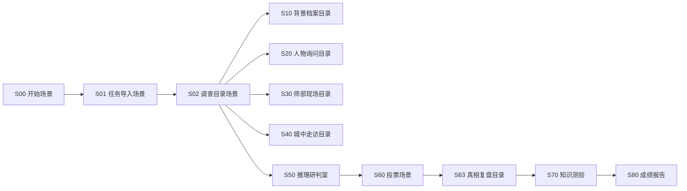

# 《星火映果州》VR课件交互逻辑偏好

## 核心原则

建委需要的是 Nibiru 式“场景到场景”的交互逻辑，而不是普通故事梳理。

表达时必须清楚回答：

1. 当前是什么场景？
2. 场景里有什么画面？
3. 场景里有什么按钮或热点？
4. 用户点击后跳转到哪个场景？
5. 完成内容后如何返回目录或进入下一步？

## 推荐总结构



## 场景表达模板

```markdown
## S00 开始场景

### 场景定位
说明这个场景承担什么功能。

### 画面设计
说明用户看到的环境、物品、氛围。

### 交互设置
| 元素 | 类型 | 显示文字 | 结果 |
|-|-|-|-|
| 主按钮 | 点击按钮 | 立即开始 | 跳转S01 |

### 跳转逻辑
说明点击哪个元素去哪个场景。
```

## 原创化要求

不要复刻参考网页的首屏、角色头像选择页或网页式投票页。

建议采用“机要档案调查”视觉结构：

- 开始场景：机要档案启封。
- 调查目录：案件总台 + 五个档案夹。
- 人物询问：人物档案墙，不是角色扮演选择页。
- 投票场景：六份密封档案袋，不是头像网格。

## 客户文档要求

客户外发文档应命名为《星火映果州》VR交互课件建设方案一类正式标题。

不要出现：

- 客户版
- 客户可见
- 演示版
- Nibiru / Creator
- AI提示词
- 变量 / 条件器
- 制作软件 / 技术实现
- 参考链接 / 参考网页

客户文档重点写：

- 用户看到什么
- 用户点击什么
- 用户进入哪里
- 用户获得什么信息
- 教学目标如何达成

## 制作端文档要求

制作端可以包含：

- 场景ID
- 场景跳转表
- 按钮与热点
- 返回目录逻辑
- Nibiru制作注意事项
- 全景图、人物立绘、线索道具的生图提示词

## 常用场景生图提示词方向

### 开始场景

```text
生成一张VR课件开场背景图，主题为1920年代机要档案室桌面。画面中有昏暗油灯、牛皮档案袋、红色封条、旧地图、钢笔、木质桌面，氛围神秘、庄重、历史感强。桌面中央留出放置标题和“立即开始”按钮的位置。写实电影感，不要出现人物头像，不要出现现代物品、Logo、水印和可读文字。
```

### 调查目录

```text
生成一张VR课件目录场景图，主题为民国案件调查总台。桌面中央是一张顺庆城地图，周围摆放五个牛皮档案夹、红线、图钉、证据照片、油灯。五个档案夹位置清晰，分别适合后期添加“背景档案、人物询问、师部现场、城中走访、推理研判”按钮。写实、整洁、沉浸式调查氛围，不要生成文字、Logo、水印。
```

### 保密室

```text
生成一张360度VR全景图，比例2:1，民国军阀师部保密室。空间狭小，包含铁门、铜锁、木质文件柜、檀木文件盒、封蜡、登记册、昏暗油灯。门锁、登记册、木盒三个区域要明显，适合放置交互热点。氛围压抑、机密、冷清，不要出现现代保险柜、电子屏幕、文字、Logo和水印。
```

### 医院病房

```text
生成一张360度VR全景图，比例2:1，1920年代民国医院病房。画面包含铁架病床、白色床单、木制药柜、缴费单据、药瓶、昏黄灯光、窗外风雪和远处模糊监视者剪影。床底需要有适合放置隐藏文件热点的暗处，桌面适合放置缴费单、药品记录和纸条。氛围压抑、焦虑、带有秘密交易感，不要出现现代医疗设备、现代文字、Logo和水印。
```

## 当前项目关键剧情逻辑

- 真凶：黄锦章。
- 作案动机：母亲重病，受何光烈收买与胁迫。
- 作案手段：观察秦汉三进入保密室后，趁秦离开拓印钥匙，再配钥匙进入保密室。
- 核心证据：钥匙暗痕、保密室无撬痕、出入记录、医院缴费单、购药记录、交易字条、病床下宣言。
- 红鲱鱼：杨冠风身份可疑，但本案没有盗取宣言；陈月蓉账本可疑但实际是起义军费；杜伯乾秘密行动是组织工作。
