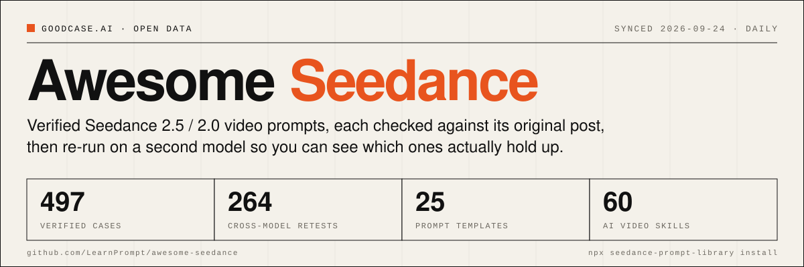
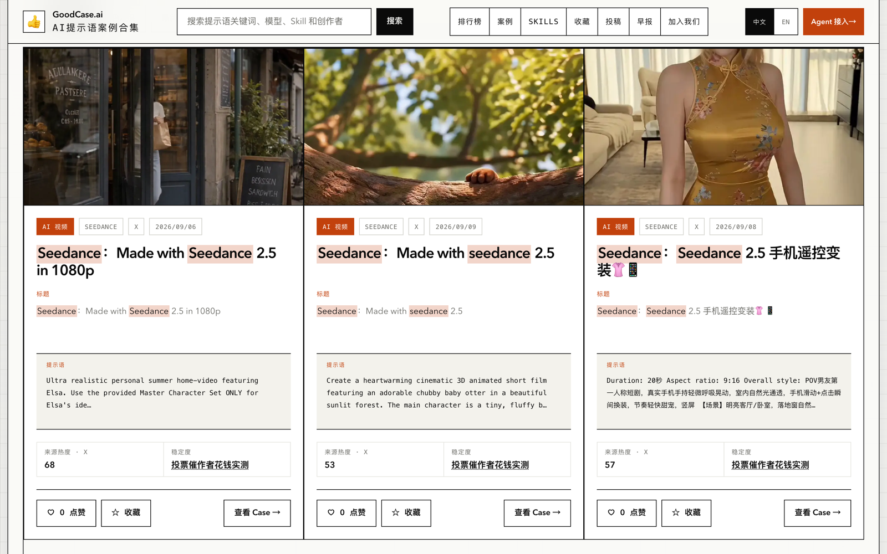

[English](./README.md) | [中文](./README_zh.md) | **[日本語](./README_ja.md)**

# Awesome Seedance 

**検証済み Seedance 2.5 / 2.0 プロンプトライブラリ。** 497 ケースをすべて元投稿と照合、264 回のクロスモデル再テスト、25 個の再利用可能テンプレート、60 個のインストール可能な AI 動画 Skill。母体は goodcase.ai の動画・画像・UI・コピーにまたがる 1237 件の検証済み AI ケース。毎日同期し、新しいケースが毎日追加されます。

        

プロンプト全文付きの検証済み AI ケースをもっと見る → [GoodCase.ai](https://goodcase.ai/cases?filter=video&utm_source=awesome-seedance)

## 目次

- [🚀 ここから始める](#-ここから始める)
- [🧩 カテゴリ別プロンプトテンプレート](#-カテゴリ別プロンプトテンプレート)
- [🧰 Skill](#-skill)
- [🔥 ヒート Top 30](#-ヒート-top-30)
- [🔁 クロスモデル再テスト](#-クロスモデル再テスト)
- [🎬 全プロンプト](#-全プロンプト)
- [🌐 goodcase.ai で閲覧](#-goodcaseai-で閲覧)
- [このリストの特徴](#このリストの特徴)
- [統計](#統計)
- [コントリビュート](#コントリビュート)
- [🙏 謝辞](#-謝辞)
- [👤 作者](#-作者)
## 🚀 ここから始める

AI 動画が初めてでも、この 5 ステップで自分のクリップが作れます。インストールは不要です。

| ステップ | やること |
| --- | --- |
| 1 | [カテゴリ別プロンプトテンプレート](#-カテゴリ別プロンプトテンプレート)で、作りたい絵柄を画像から選びます。 |
| 2 | そのテンプレート（例: [UGC creator review](./docs/templates/en/ugc-creator-review.md)、英語）を開き、*Copy this* の下のブロックをコピーします。 |
| 3 | [角括弧] の部分を自分の商品、人物、シーンに置き換えます。 |
| 4 | 参照画像と一緒に任意の AI チャット（ChatGPT、Claude、Gemini）に送ると、完成したプロンプトが返ってきます。 |
| 5 | そのプロンプトを Seedance（Dreamina / 即夢）に貼って生成します。うまくいかないときはテンプレートの落とし穴を確認して再実行します。 |

**テンプレートと Skill、どちらを使う？** どちらも同じ 497 件の検証済みケースから作られています。違いは誰が作業するかです。

|  | [プロンプトテンプレート](#-カテゴリ別プロンプトテンプレート) | [Skill](#-skill) |
| --- | --- | --- |
| **向いている人** | 初心者、何もインストールしたくない人 | すでに Claude Code や Codex などのエージェントを使っている人 |
| **使い方** | コピーして [角括弧] を置き換え、任意の AI チャットに貼る | コマンド 1 行で導入し、あとはエージェントに要望を伝えるだけ |
| **カバー範囲** | カテゴリ別テンプレート 25 個 | 同じテンプレートにスタイルライブラリを加えた、60 個の Skill とクリエイター版 |
| **得られるもの** | 確かなプロンプトを 1 本ずつ | 複数の画風のプロンプトをまとめて。選択と埋め込みはエージェントが代行 |

ケースを眺めたいだけなら[ヒート Top 30](#-ヒート-top-30) か[全ケース](#-全プロンプト)へ。プロンプトの再現性を確かめたいなら[クロスモデル再テスト](#-クロスモデル再テスト)をどうぞ。

## 🧩 カテゴリ別プロンプトテンプレート

作りたいクリップの種類ごとに 25 個のテンプレート。448 件の検証済みケースから抽出しました。絵柄で選んでテンプレートを開き、ブロックをコピーして [角括弧] の部分を自分の内容に置き換え、任意の AI チャットに渡してください。一覧は[テンプレート索引](./docs/templates/en/README.md)（英語）にあります。

### 🧱 Structural foundations（テンプレート 3 件）

Cross-cutting skeletons that almost every other template builds on: how to slice a clip into timed beats, and how to pin an identity across those beats.

<table>
<tr>
<td width="33%" valign="top" align="center"><b>タイムラインとショット脚本</b> 分類済み 4 件   Split the clip into contiguous timed segments, each carrying one shot type, one main action and its own sound line. The single most load-bearing structure in the corpus. <a href="./docs/templates/en/timeline-shot-script.md"><b>テンプレートを開く</b></a> · <a href="https://goodcase.ai/cases/boa-hancock-water-obstacle-race-prompt">トップケース</a></td>
<td width="33%" valign="top" align="center"><b>参照画像とアイデンティティ固定</b> 分類済み 5 件   Name every reference with a stable token, enumerate what to inherit from it, and separately enumerate what must not be inherited. The inherit-nothing-else clause is what separates working locks from broken ones. <a href="./docs/templates/en/character-reference-lock.md"><b>テンプレートを開く</b></a> · <a href="https://goodcase.ai/cases/elsasofia-ai-seedance-ai-e087ab2aed4b">トップケース</a></td>
<td width="33%" valign="top" align="center"><b>絵コンテグリッドから動画へ</b> 分類済み 9 件   Two stages: first a single-page sheet of numbered panels from an image model, then that sheet fed to Seedance as the reference. The sheet owns order, framing and timing, and the video prompt only has to connect the panels. <a href="./docs/templates/en/storyboard-grid-to-video.md"><b>テンプレートを開く</b></a> · <a href="https://goodcase.ai/cases/real-case-06-aimikoda">トップケース</a></td>
</tr>
</table>

### 📱 Realism and UGC（テンプレート 4 件）

Templates that buy believability by describing camera flaws, body wear and consumer-grade optics instead of asking for quality.

<table>
<tr>
<td width="33%" valign="top" align="center"><b>手持ち UGC vlog</b> 分類済み 92 件   Buy believability with camera defects. Name a specific consumer camera era, list its flaws as requirements, and switch cinematic polish off by hand. <a href="./docs/templates/en/handheld-ugc-vlog.md"><b>テンプレートを開く</b></a> · <a href="https://goodcase.ai/cases/seedance-25-minidv-coffee-asmr-vlog">トップケース</a></td>
<td width="33%" valign="top" align="center"><b>一人称 POV ワンテイク</b> 分類済み 11 件   Bodycam, GoPro, FPV and handlebar POV. The camera is mounted on a body, so its motion has to be derived from that body, and every cut has to be declared by hand. <a href="./docs/templates/en/pov-continuous-take.md"><b>テンプレートを開く</b></a> · <a href="https://goodcase.ai/cases/seedance-2-5-gopro-94a73eef1dbf">トップケース</a></td>
<td width="33%" valign="top" align="center"><b>2000年代初頭のDVホームビデオ</b> 分類済み 17 件   The period feel comes from camera defects and one tiny everyday incident. Write the camcorder's autofocus hunting, exposure shifts and handheld shake as an explicit list, keep the story small, and the clip reads as a real old tape. <a href="./docs/templates/en/retro-found-footage.md"><b>テンプレートを開く</b></a> · <a href="https://goodcase.ai/cases/seedance-prompt-create-a-30-second-1080p-ultra-realistic-personal-home-video-showing-a-f4036ce777fe">トップケース</a></td>
</tr>
<tr>
<td width="33%" valign="top" align="center"><b>ペット・動物が主役</b> 分類済み 13 件   The animal is the lead and a phone is the only camera. Lock the count to exactly one, keep the animal behaving like an animal, and let the payoff come from it closing in on the lens. <a href="./docs/templates/en/pet-animal.md"><b>テンプレートを開く</b></a> · <a href="https://goodcase.ai/cases/mrdasonx-seedance-ai-ccaa50150259">トップケース</a></td>
</tr>
</table>

### 🛒 Commercial and product（テンプレート 4 件）

Ad-shaped structures where a product has to survive macro shots, hand contact and a hero frame without deforming.

<table>
<tr>
<td width="33%" valign="top" align="center"><b>UGC クリエイターレビュー</b> 分類済み 11 件   A creator unboxes, handles and endorses a product on camera. Two independent locks are needed — one on the person, one on the product — and the spoken lines are welded into the actions. <a href="./docs/templates/en/ugc-creator-review.md"><b>テンプレートを開く</b></a> · <a href="https://goodcase.ai/cases/sophiaparkerr-seedance-ai-51ad3cc85989">トップケース</a></td>
<td width="33%" valign="top" align="center"><b>プロダクト CM のショットリスト</b> 分類済み 27 件   A polished 8 to 20 second ad: a stated commercial aesthetic up front, a numbered or timed shot breakdown in the middle, a hero frame at the end, and a keyword tail. <a href="./docs/templates/en/product-commercial-shotlist.md"><b>テンプレートを開く</b></a> · <a href="https://goodcase.ai/cases/juliaevee-seedance-ai-ae713e2e2dbc">トップケース</a></td>
<td width="33%" valign="top" align="center"><b>プロセスと変化のモンタージュ</b> 分類済み 16 件   Cooking steps, renovation timelapse, blueprint-to-house, miniature city assembly. The craft here is declaring what must not change, then ordering the change spatially. <a href="./docs/templates/en/process-transformation-montage.md"><b>テンプレートを開く</b></a> · <a href="https://goodcase.ai/cases/yesandyou-seedance-ai-2a9dc20c947d">トップケース</a></td>
</tr>
<tr>
<td width="33%" valign="top" align="center"><b>ファッション・ポートレート映像</b> 分類済み 13 件   One person, one look, a handful of places. A head-to-toe appearance lock carries the whole clip, and each scene gets one location, one gesture and one kind of light. <a href="./docs/templates/en/fashion-lookbook.md"><b>テンプレートを開く</b></a> · <a href="https://goodcase.ai/cases/youmind-paris-fashion-campaign-streetwear">トップケース</a></td>
</tr>
</table>

### 🎭 Narrative and performance（テンプレート 5 件）

Templates where the payload is a story beat or a line of dialogue rather than a look.

<table>
<tr>
<td width="33%" valign="top" align="center"><b>対話と演技のビート</b> 分類済み 8 件   Declare the spoken language, tag the speaker, write the reaction as a causal chain rather than a list of expressions, and close each beat with an explicit end state. <a href="./docs/templates/en/dialogue-performance-beats.md"><b>テンプレートを開く</b></a> · <a href="https://goodcase.ai/cases/noorlewisx-seedance-ai-b2d98861daf9">トップケース</a></td>
<td width="33%" valign="top" align="center"><b>シネマティック短編</b> 分類済み 30 件   Multi-act storytelling in 15 to 60 seconds. Titled acts, a character card ahead of the acts, and a reveal written as a concrete image rather than as a promise of surprise. <a href="./docs/templates/en/cinematic-narrative-short.md"><b>テンプレートを開く</b></a> · <a href="https://goodcase.ai/cases/seedance-create-a-30-second-1080p-ultra-realistic-emotional-live-action-scene-about-a-y-8c4cbeb0026b">トップケース</a></td>
<td width="33%" valign="top" align="center"><b>シネマティック旅行モンタージュ</b> 分類済み 12 件   One traveller moves through a place scene by scene, each scene carrying its own timecode, its own location and one short line. The polish is bought with film grain and golden-hour light. <a href="./docs/templates/en/travel-city-walk.md"><b>テンプレートを開く</b></a> · <a href="https://goodcase.ai/cases/seedance-a-cinematic-30-second-tropical-travel-vlog-montage-featuring-a-beautiful-20-yea-6af38a792806">トップケース</a></td>
</tr>
<tr>
<td width="33%" valign="top" align="center"><b>どんでん返しコメディ</b> 分類済み 22 件   A short skit where every beat is laid down to serve one punchline. The joke has to land on something visible, and the absurdity only works when the camera and the physics stay dead serious. <a href="./docs/templates/en/meme-comedy.md"><b>テンプレートを開く</b></a> · <a href="https://goodcase.ai/cases/seedance-create-a-30-second-1080p-ultra-realistic-korean-subway-action-comedy-scene-usi-93b40e9db5b1">トップケース</a></td>
<td width="33%" valign="top" align="center"><b>ホラー・サスペンス短編</b> 分類済み 11 件   Every shot carries its own timecode and shows one visible change on a body. The dread comes from the chain — a look, veins, a bite, the next person — and the ending seals a door without settling anything. <a href="./docs/templates/en/horror-suspense.md"><b>テンプレートを開く</b></a> · <a href="https://goodcase.ai/cases/seedance-shot-1-0-0-1-2s-image-1-face-and-outfit-matching-reference-lying-in-b6d9ef0e370e">トップケース</a></td>
</tr>
</table>

### 🎨 Stylized animation（テンプレート 3 件）

Non-photoreal looks that collapse into generic CG unless the style is specified as measurable parameters plus an exclusion list.

<table>
<tr>
<td width="33%" valign="top" align="center"><b>アニメと様式化の画風固定</b> 分類済み 25 件   Specify the drawing style as measurable parameters, then attach an exclusion list of the neighbouring styles it must not fall into. Without the exclusion list, anime collapses into a generic 3D face. <a href="./docs/templates/en/anime-style-lock.md"><b>テンプレートを開く</b></a> · <a href="https://goodcase.ai/cases/2d-38a41133eab1">トップケース</a></td>
<td width="33%" valign="top" align="center"><b>ストップモーションとコマ撮りのリズム</b> 分類済み 9 件   Stop motion is a timing spec before it is a look. Pin the frame rate and the hold count, name the craft material, and ban the three things that silently smooth it away. <a href="./docs/templates/en/stop-motion-cadence.md"><b>テンプレートを開く</b></a> · <a href="https://goodcase.ai/cases/erling-haaland-525acabe78da">トップケース</a></td>
<td width="33%" valign="top" align="center"><b>3Dカートゥーン短編</b> 分類済み 15 件   One small anthropomorphic character carries the whole film. Spell out its looks part by part, write the style as render settings you can measure, and cut the timeline so each block holds a single action goal. <a href="./docs/templates/en/3d-cartoon.md"><b>テンプレートを開く</b></a> · <a href="https://goodcase.ai/cases/ayzalnooor24521-seedance-ai-4a336f514777">トップケース</a></td>
</tr>
</table>

### 💥 Action, dance and effects（テンプレート 6 件）

Templates driven by body mechanics, beat placement or a physics set-piece rather than by scene description.

<table>
<tr>
<td width="33%" valign="top" align="center"><b>格闘のコレオグラフィ</b> 分類済み 40 件   Fights read as real when the prompt specifies biomechanics, contact points and an attack chain. Adjectives like epic produce two people swinging at air. <a href="./docs/templates/en/combat-choreography.md"><b>テンプレートを開く</b></a> · <a href="https://goodcase.ai/cases/aiwithelisia-seedance-ai-b204cdfb3dac">トップケース</a></td>
<td width="33%" valign="top" align="center"><b>ビート同期ミュージックビデオ</b> 分類済み 12 件   Derive beat anchors from BPM, pin every cut, hair flip and formation change to a real downbeat, and constrain the backup dancers so they never steal the visual centre. <a href="./docs/templates/en/music-beat-sync-mv.md"><b>テンプレートを開く</b></a> · <a href="https://goodcase.ai/cases/seedance-25-kpop-mv-dual-idol">トップケース</a></td>
<td width="33%" valign="top" align="center"><b>時間停止と巻き戻しの見せ場</b> 分類済み 5 件   A five-beat skeleton — normal, collision, freeze at the peak, orbit, precise rewind — with exactly one character exempt from the freeze. The corpus contains the same author reusing this skeleton with a different physical material, which is direct evidence that it transfers. <a href="./docs/templates/en/time-freeze-rewind.md"><b>テンプレートを開く</b></a> · <a href="https://goodcase.ai/cases/seedance-25-diner-frozen-time-rewind">トップケース</a></td>
</tr>
<tr>
<td width="33%" valign="top" align="center"><b>クルマと乗り物のスピード映像</b> 分類済み 10 件   The machine has to stay one machine while the camera does all the work. Lock the vehicle part by part, then fill the runtime with a numbered cut list that moves the camera every second. <a href="./docs/templates/en/car-vehicle.md"><b>テンプレートを開く</b></a> · <a href="https://goodcase.ai/cases/ruzainameer-seedance-ai-e6073ec318f1">トップケース</a></td>
<td width="33%" valign="top" align="center"><b>壮大なファンタジー・SF大作</b> 分類済み 21 件   Monsters, dragons, world reveals. Each entity gets its own definition block, the shots are cut by timecode, and scale is bought with reference objects and low angles rather than words like massive. <a href="./docs/templates/en/epic-fantasy-scifi.md"><b>テンプレートを開く</b></a> · <a href="https://goodcase.ai/cases/seedance-create-a-30-second-ultra-cinematic-supernatural-fantasy-sequence-photorealisti-6d87ff7834d3">トップケース</a></td>
<td width="33%" valign="top" align="center"><b>スポーツ・エクストリーム映像</b> 分類済み 10 件   The clip lives or dies on the action loop. Write every link from run-up to landing in order, name the physics you want by part, and spend the negative list on flying, hovering and teleporting. <a href="./docs/templates/en/sports-extreme.md"><b>テンプレートを開く</b></a> · <a href="https://goodcase.ai/cases/seedance-269d1fc95820">トップケース</a></td>
</tr>
</table>

## 🧰 Skill

Skill は Claude Code や Codex などのエージェントに入れる指示パックです。入れたあとは作りたいものを伝えるだけで、テンプレート選択、構造の埋め込み、スタイルライブラリからの複数ルック出しまでエージェントが行います。以下に 29 個の Skill、さらにクリエイター個人のスタイルを持つ 31 個のバリアントがあります。

<table>
<tr>
<td width="33%" valign="top" align="center"><table><tbody><tr><td></td><td></td></tr><tr><td></td><td></td></tr></tbody></table><a href="https://github.com/LearnPrompt/awesome-seedance/tree/main/agents/skills/seedance-prompt-library"><b>Seedance プロンプトライブラリ</b></a> このリポジトリの Skill。このページの全カテゴリテンプレートとスタイルライブラリをエージェントに入れ、エディタ内で構造化された Seedance プロンプトを書かせます。  <code>npx seedance-prompt-library install</code></td>
<td width="33%" valign="top" align="center"><table><tbody><tr><td></td><td></td></tr><tr><td></td><td></td></tr></tbody></table><a href="https://github.com/LearnPrompt/awesome-seedance/tree/main/agents/skills/seedance-meme-comedy"><b>どんでん返しコメディ</b></a> すべてのビートが一つのオチに向かい、オチは目に見えるものに落ちる。荒唐な設定を真顔のカメラで撮る。  <code>npx skills add LearnPrompt/awesome-seedance --skill seedance-meme-comedy</code></td>
<td width="33%" valign="top" align="center"><table><tbody><tr><td></td><td></td></tr><tr><td></td><td></td></tr></tbody></table><a href="https://github.com/LearnPrompt/awesome-seedance/tree/main/agents/skills/seedance-epic-fantasy-scifi"><b>壮大なファンタジー・SF大作</b></a> ドラゴン、巨人、世界観の提示。実体ごとに定義ブロック、タイムコードでカット、スケール感はローアングルと対比物で作る。  <code>npx skills add LearnPrompt/awesome-seedance --skill seedance-epic-fantasy-scifi</code></td>
</tr>
<tr>
<td width="33%" valign="top" align="center"><table><tbody><tr><td></td><td></td></tr><tr><td></td><td></td></tr></tbody></table><a href="https://github.com/LearnPrompt/awesome-seedance/tree/main/agents/skills/seedance-retro-dv-home-video"><b>2000年代初頭のDVホームビデオ</b></a> カムコーダーの欠点リストと日常の小さな出来事で時代感を作る。本物の古いテープのような一本。  <code>npx skills add LearnPrompt/awesome-seedance --skill seedance-retro-dv-home-video</code></td>
<td width="33%" valign="top" align="center"><table><tbody><tr><td></td><td></td></tr><tr><td></td><td></td></tr></tbody></table><a href="https://github.com/LearnPrompt/awesome-seedance/tree/main/agents/skills/seedance-3d-cartoon"><b>3Dカートゥーン短編</b></a> 魅力的なキャラクター一人が一本を支える。造形をパーツ単位で固定し、画風は測れるレンダリング項目で書き、タイムラインは一区切り一動作。  <code>npx skills add LearnPrompt/awesome-seedance --skill seedance-3d-cartoon</code></td>
<td width="33%" valign="top" align="center"><table><tbody><tr><td></td><td></td></tr><tr><td></td><td></td></tr></tbody></table><a href="https://github.com/LearnPrompt/awesome-seedance/tree/main/agents/skills/seedance-storyboard-grid-to-video"><b>絵コンテグリッドから動画へ</b></a> 画像モデルで番号付きコマの絵コンテを 1 枚作り、それを参照として Seedance に渡す 2 段階の作り方。順番、構図、尺は絵コンテが決め、動画プロンプトはコマをつなぐだけ。  <code>npx skills add LearnPrompt/awesome-seedance --skill seedance-storyboard-grid-to-video</code></td>
</tr>
<tr>
<td width="33%" valign="top" align="center"><table><tbody><tr><td></td><td></td></tr><tr><td></td><td></td></tr></tbody></table><a href="https://github.com/LearnPrompt/awesome-seedance/tree/main/agents/skills/seedance-travel-city-walk"><b>シネマティック旅行モンタージュ</b></a> 一人の旅人がシーンごとに場所を歩き、各シーンにタイムコード、場所、短いひと言。質感はフィルムグレインとゴールデンアワーの光で作る。  <code>npx skills add LearnPrompt/awesome-seedance --skill seedance-travel-city-walk</code></td>
<td width="33%" valign="top" align="center"><table><tbody><tr><td></td><td></td></tr><tr><td></td><td></td></tr></tbody></table><a href="https://github.com/LearnPrompt/awesome-seedance/tree/main/agents/skills/seedance-pet-animal"><b>ペット・動物が主役</b></a> 動物が主役で、カメラはスマホ 1 台。頭数は 1 匹に固定し、動物は動物らしく振る舞い、オチはレンズに迫ってくる動きで。  <code>npx skills add LearnPrompt/awesome-seedance --skill seedance-pet-animal</code></td>
<td width="33%" valign="top" align="center"><table><tbody><tr><td></td><td></td></tr><tr><td></td><td></td></tr></tbody></table><a href="https://github.com/LearnPrompt/awesome-seedance/tree/main/agents/skills/seedance-car-vehicle"><b>クルマと乗り物のスピード映像</b></a> 車両は最初から最後まで同じ 1 台、働くのはカメラ。部品単位で固定し、毎秒カメラ位置が変わる番号付きカット表で尺を埋める。  <code>npx skills add LearnPrompt/awesome-seedance --skill seedance-car-vehicle</code></td>
</tr>
<tr>
<td width="33%" valign="top" align="center"><table><tbody><tr><td></td><td></td></tr><tr><td></td><td></td></tr></tbody></table><a href="https://github.com/LearnPrompt/awesome-seedance/tree/main/agents/skills/seedance-fashion-lookbook"><b>ファッション・ポートレート映像</b></a> 一人、一つのスタイル、いくつかの場所。頭からつま先までの外見ロックが全体を支え、各シーンは場所・仕草・光を一つずつ。  <code>npx skills add LearnPrompt/awesome-seedance --skill seedance-fashion-lookbook</code></td>
<td width="33%" valign="top" align="center"><table><tbody><tr><td></td><td></td></tr><tr><td></td><td></td></tr></tbody></table><a href="https://github.com/LearnPrompt/awesome-seedance/tree/main/agents/skills/seedance-horror-suspense"><b>ホラー・サスペンス短編</b></a> 各ショットにタイムコード、体に起きる目に見える変化は一つ。恐怖は連鎖から生まれ、結末はドアを閉めて何も解決しない。  <code>npx skills add LearnPrompt/awesome-seedance --skill seedance-horror-suspense</code></td>
<td width="33%" valign="top" align="center"><table><tbody><tr><td></td><td></td></tr><tr><td></td><td></td></tr></tbody></table><a href="https://github.com/LearnPrompt/awesome-seedance/tree/main/agents/skills/seedance-sports-extreme"><b>スポーツ・エクストリーム映像</b></a> 助走から着地までの動作の連鎖がすべて。物理は部位ごとに指定し、ネガティブリストで飛行・浮遊・瞬間移動を潰す。  <code>npx skills add LearnPrompt/awesome-seedance --skill seedance-sports-extreme</code></td>
</tr>
<tr>
<td width="33%" valign="top" align="center"><table><tbody><tr><td></td><td></td></tr><tr><td></td><td></td></tr></tbody></table><a href="https://github.com/LearnPrompt/goodcase-lite"><b>GoodCase ケース検索</b></a> エージェントが goodcase.ai のライブラリ全体をリアルタイム検索します。全モデル、完全なプロンプト、ヒート、安定度スコア、再テスト基準。  <code>npx skills add LearnPrompt/goodcase-lite --skill goodcase</code></td>
<td width="33%" valign="top" align="center"><table><tbody><tr><td></td><td></td></tr><tr><td></td><td></td></tr></tbody></table><a href="https://goodcase.ai/skills/pov-vlog-presence?utm_source=awesome-seedance"><b>POV / Vlog の臨場感</b></a> 一人称の構図、手持ちの揺れ、生活感のあるディテールで、その場にいたような実在感を作ります。  <code>npx skills add LearnPrompt/goodcase-lite --skill pov-vlog-presence</code> <a href="https://goodcase.ai/skills/pov-vlog-presence?utm_source=awesome-seedance">クリエイター版 10 件</a></td>
<td width="33%" valign="top" align="center"><table><tbody><tr><td></td><td></td></tr><tr><td></td><td></td></tr></tbody></table><a href="https://goodcase.ai/skills/product-ad-shot-design?utm_source=awesome-seedance"><b>プロダクト広告のショット設計</b></a> 商品の売りから出発し、冒頭のフック、使用シーン、ブランドの締めショットを組み立てます。  <code>npx skills add LearnPrompt/goodcase-lite --skill product-ad-shot-design</code> <a href="https://goodcase.ai/skills/product-ad-shot-design?utm_source=awesome-seedance">クリエイター版 5 件</a></td>
</tr>
<tr>
<td width="33%" valign="top" align="center"><table><tbody><tr><td></td><td></td></tr><tr><td></td><td></td></tr></tbody></table><a href="https://goodcase.ai/skills/animation-style-consistency?utm_source=awesome-seedance"><b>アニメの画風とキャラクターの一貫性</b></a> 複数ショットのアニメで、キャラクター造形、動きの語彙、質感と画風を固定します。  <code>npx skills add LearnPrompt/goodcase-lite --skill animation-style-consistency</code> <a href="https://goodcase.ai/skills/animation-style-consistency?utm_source=awesome-seedance">クリエイター版 2 件</a></td>
<td width="33%" valign="top" align="center"><table><tbody><tr><td></td><td></td></tr><tr><td></td><td></td></tr></tbody></table><a href="https://goodcase.ai/skills/action-continuity-choreography?utm_source=awesome-seedance"><b>アクションの連続性設計</b></a> キャラクター、動きの方向、リズム、ショットのつなぎを、再現可能なアクションシーケンスとして書き出します。  <code>npx skills add LearnPrompt/goodcase-lite --skill action-continuity-choreography</code> <a href="https://goodcase.ai/skills/action-continuity-choreography?utm_source=awesome-seedance">クリエイター版 1 件</a></td>
<td width="33%" valign="top" align="center"><table><tbody><tr><td></td><td></td></tr><tr><td></td><td></td></tr></tbody></table><a href="https://goodcase.ai/skills/process-transformation-story?utm_source=awesome-seedance"><b>プロセスと変化のストーリー</b></a> 制作過程、変身、ビフォーアフターを、明快で気持ちのよい段階の連なりとして語ります。  <code>npx skills add LearnPrompt/goodcase-lite --skill process-transformation-story</code></td>
</tr>
<tr>
<td width="33%" valign="top" align="center"><table><tbody><tr><td></td><td></td></tr><tr><td></td><td></td></tr></tbody></table><a href="https://goodcase.ai/skills/retro-dv-home-video?utm_source=awesome-seedance"><b>2000年代初頭のDVホームビデオ</b></a> カムコーダーの欠点リストと日常の小さな出来事で時代感を作り、本物の古いテープのように見せます。  <code>npx skills add LearnPrompt/goodcase-lite --skill retro-dv-home-video</code> <a href="https://goodcase.ai/skills/retro-dv-home-video?utm_source=awesome-seedance">クリエイター版 2 件</a></td>
<td width="33%" valign="top" align="center"><table><tbody><tr><td></td><td></td></tr><tr><td></td><td></td></tr></tbody></table><a href="https://goodcase.ai/skills/epic-fantasy-scifi-spectacle?utm_source=awesome-seedance"><b>壮大なファンタジー・SF大作</b></a> ドラゴン、巨人、世界観の提示。実体ごとに定義ブロック、タイムコードでカット、ローアングルと対比物でスケール感を作ります。  <code>npx skills add LearnPrompt/goodcase-lite --skill epic-fantasy-scifi-spectacle</code> <a href="https://goodcase.ai/skills/epic-fantasy-scifi-spectacle?utm_source=awesome-seedance">クリエイター版 4 件</a></td>
<td width="33%" valign="top" align="center"><table><tbody><tr><td></td><td></td></tr><tr><td></td><td></td></tr></tbody></table><a href="https://goodcase.ai/skills/twist-comedy-skit?utm_source=awesome-seedance"><b>どんでん返しコメディ</b></a> すべてのビートが一つのオチに向かい、オチは目に見えるものに落ちる。荒唐な設定を真顔のカメラで撮ります。  <code>npx skills add LearnPrompt/goodcase-lite --skill twist-comedy-skit</code> <a href="https://goodcase.ai/skills/twist-comedy-skit?utm_source=awesome-seedance">クリエイター版 1 件</a></td>
</tr>
<tr>
<td width="33%" valign="top" align="center"><table><tbody><tr><td></td><td></td></tr><tr><td></td><td></td></tr></tbody></table><a href="https://goodcase.ai/skills/3d-cartoon-character-short?utm_source=awesome-seedance"><b>3Dカートゥーン短編</b></a> 魅力的なキャラクター一人が一本を支える。造形をパーツ単位で固定し、画風は測れるレンダリング項目で書き、タイムラインは一区切り一動作。  <code>npx skills add LearnPrompt/goodcase-lite --skill 3d-cartoon-character-short</code> <a href="https://goodcase.ai/skills/3d-cartoon-character-short?utm_source=awesome-seedance">クリエイター版 1 件</a></td>
<td width="33%" valign="top" align="center"><table><tbody><tr><td></td><td></td></tr><tr><td></td><td></td></tr></tbody></table><a href="https://goodcase.ai/skills/travel-city-walk?utm_source=awesome-seedance"><b>シネマティック旅行モンタージュ</b></a> 一人の旅人がシーンごとに場所を歩き、各シーンにタイムコード、場所、短いひと言。質感はフィルムグレインとゴールデンアワーの光で作ります。  <code>npx skills add LearnPrompt/goodcase-lite --skill travel-city-walk</code> <a href="https://goodcase.ai/skills/travel-city-walk?utm_source=awesome-seedance">クリエイター版 2 件</a></td>
<td width="33%" valign="top" align="center"><table><tbody><tr><td></td><td></td></tr><tr><td></td><td></td></tr></tbody></table><a href="https://goodcase.ai/skills/pets-and-animals-lead?utm_source=awesome-seedance"><b>ペット・動物が主役</b></a> 動物が主役でカメラはスマホ 1 台。頭数は 1 匹に固定し、動物らしく振る舞わせ、オチはレンズに迫る動きで。  <code>npx skills add LearnPrompt/goodcase-lite --skill pets-and-animals-lead</code> <a href="https://goodcase.ai/skills/pets-and-animals-lead?utm_source=awesome-seedance">クリエイター版 1 件</a></td>
</tr>
<tr>
<td width="33%" valign="top" align="center"><table><tbody><tr><td></td><td></td></tr><tr><td></td><td></td></tr></tbody></table><a href="https://goodcase.ai/skills/vehicles-at-speed?utm_source=awesome-seedance"><b>クルマと乗り物のスピード映像</b></a> 車両は最初から最後まで同じ 1 台、働くのはカメラ。部品単位で固定し、毎秒カメラが動く番号付きカット表で尺を埋めます。  <code>npx skills add LearnPrompt/goodcase-lite --skill vehicles-at-speed</code></td>
<td width="33%" valign="top" align="center"><table><tbody><tr><td></td><td></td></tr><tr><td></td><td></td></tr></tbody></table><a href="https://goodcase.ai/skills/fashion-lookbook-portrait?utm_source=awesome-seedance"><b>ファッション・ポートレート映像</b></a> 一人、一つのスタイル、いくつかの場所。頭からつま先までの外見ロックが全体を支え、各シーンは場所・仕草・光を一つずつ。  <code>npx skills add LearnPrompt/goodcase-lite --skill fashion-lookbook-portrait</code> <a href="https://goodcase.ai/skills/fashion-lookbook-portrait?utm_source=awesome-seedance">クリエイター版 1 件</a></td>
<td width="33%" valign="top" align="center"><table><tbody><tr><td></td><td></td></tr><tr><td></td><td></td></tr></tbody></table><a href="https://goodcase.ai/skills/horror-suspense-short?utm_source=awesome-seedance"><b>ホラー・サスペンス短編</b></a> 各ショットにタイムコード、体に起きる目に見える変化は一つ。恐怖は連鎖から生まれ、結末はドアを閉めて何も解決しません。  <code>npx skills add LearnPrompt/goodcase-lite --skill horror-suspense-short</code> <a href="https://goodcase.ai/skills/horror-suspense-short?utm_source=awesome-seedance">クリエイター版 1 件</a></td>
</tr>
<tr>
<td width="33%" valign="top" align="center"><table><tbody><tr><td></td><td></td></tr><tr><td></td><td></td></tr></tbody></table><a href="https://goodcase.ai/skills/sports-extreme-stunts?utm_source=awesome-seedance"><b>スポーツ・エクストリーム映像</b></a> 助走から着地までの動作の連鎖がすべて。物理は部位ごとに指定し、ネガティブリストで飛行・浮遊・瞬間移動を潰します。  <code>npx skills add LearnPrompt/goodcase-lite --skill sports-extreme-stunts</code></td>
<td width="33%" valign="top" align="center"><table><tbody><tr><td></td><td></td></tr><tr><td></td><td></td></tr></tbody></table><a href="https://goodcase.ai/skills/storyboard-grid-to-video?utm_source=awesome-seedance"><b>絵コンテグリッドから動画へ</b></a> 画像モデルで番号付きコマの絵コンテを 1 枚作り、それを参照として Seedance に渡す 2 段階。順番、構図、尺は絵コンテが決めます。  <code>npx skills add LearnPrompt/goodcase-lite --skill storyboard-grid-to-video</code></td>
</tr>
</table>

各インストールコマンドは [skills CLI](https://github.com/vercel-labs/skills) で動きます。`seedance-…` で始まる Skill はこのリポジトリの [agents/skills](./agents/skills) にあり、ライブラリ Skill は全テンプレートを、単一ジャンルの Skill はテンプレート 1 つとそのケース証拠を持ち、毎日同じデータから再生成されます。ライブラリ Skill は `npx seedance-prompt-library install` でも Claude Code と Codex に直接入ります。画像、コーディング、ライティング向けの Skill は [goodcase.ai](https://goodcase.ai/skills?category=video&utm_source=awesome-seedance) にあります。

## 🔥 ヒート Top 30

全バージョンでヒートが高い 30 件。*プロンプト* はギャラリーの完全なエントリ、*元投稿* は作者のオリジナル投稿を開きます。

| #   | プレビュー                                                                                                                                                                                                                                                                                                                                  | ケース                                                                                                                                                                                              | バージョン | ヒート | 再テスト             | リンク                                                                                                                                                                            |
| --- | -------------------------------------------------------------------------------------------------------------------------------------------------------------------------------------------------------------------------------------------------------------------------------------------------------------------------------------- | ------------------------------------------------------------------------------------------------------------------------------------------------------------------------------------------------ | ----- | --- | ---------------- | ------------------------------------------------------------------------------------------------------------------------------------------------------------------------------ |
| 1   |                                                                                                                 | [Frozen Time and Rewind in a 1950s Diner](https://goodcase.ai/cases/seedance-25-diner-frozen-time-rewind)                                                                                        | 2.5   | 100 | ⚠️ 劣化 (スコア 63.9) | [プロンプト](./docs/gallery-seedance-2-5-part-1.ja.md#frozen-time-and-rewind-in-a-1950s-diner) · [元投稿](https://x.com/techhalla/status/2083389002552664385)                          |
| 2   |                                                                                                                                                                       | [Seoul Summer Night Vlog](https://goodcase.ai/cases/vlog-c8171f712492)                                                                                                                           | 2.5   | 99  | ✅ 再現 (スコア 75.7)  | [プロンプト](./docs/gallery-seedance-2-5-part-1.ja.md#seoul-summer-night-vlog) · [元投稿](https://x.com/AIwithkhan/status/2092971211169100048)                                         |
| 3   |                                                                                                                                  | [Mini DV Coffee ASMR Vlog](https://goodcase.ai/cases/seedance-25-minidv-coffee-asmr-vlog)                                                                                                        | 2.5   | 99  | ✅ 再現 (スコア 77.3)  | [プロンプト](./docs/gallery-seedance-2-5-part-1.ja.md#mini-dv-coffee-asmr-vlog) · [元投稿](https://x.com/Strength04_X/status/2083094742682787939)                                      |
| 4   |                                                                                                                                       | [Two-Idol K-pop MV, Shot by Shot](https://goodcase.ai/cases/seedance-25-kpop-mv-dual-idol)                                                                                                       | 2.5   | 98  | ⚠️ 劣化 (スコア 74.2) | [プロンプト](./docs/gallery-seedance-2-5-part-1.ja.md#two-idol-k-pop-mv-shot-by-shot) · [元投稿](https://x.com/Just_sharon7/status/2083422886686031982)                                |
| 5   |                                                                                                                             | [Woman in Black Stands Still Amid a Synchronized Crowd](https://goodcase.ai/cases/seedance-i-came-like-a-storm-d30f955b4248)                                                                     | 2.5   | 98  | -                | [プロンプト](./docs/gallery-seedance-2-5-part-1.ja.md#woman-in-black-stands-still-amid-a-synchronized-crowd) · [元投稿](https://x.com/AIwithkhan/status/2099707375943066094)           |
| 6   |                                                                                 | [Katsudon in a Sunlit Japanese Kitchen](https://goodcase.ai/cases/seedance-create-a-30-second-fast-paced-cinematic-japanese-anime-cooking-video-showing-th-236ad940a8f1)                         | 2.5   | 98  | -                | [プロンプト](./docs/gallery-seedance-2-5-part-1.ja.md#katsudon-in-a-sunlit-japanese-kitchen) · [元投稿](https://x.com/Goodmanprotocol/status/2098845134326808734)                      |
| 7   |                                                                               | [An Afternoon in a Hammock and Washing a Motorcycle](https://goodcase.ai/cases/seedance-subject-preserve-exact-identity-face-skin-tone-body-proportions-hair-298f82f12f00)                       | 2.5   | 96  | -                | [プロンプト](./docs/gallery-seedance-2-5-part-1.ja.md#an-afternoon-in-a-hammock-and-washing-a-motorcycle) · [元投稿](https://x.com/doctorwasif/status/2099836703729172540)             |
| 8   |                                                                          | [Parasite Infection Outbreak in a Research Lab](https://goodcase.ai/cases/seedance-cinematic-sci-fi-horror-action-short-film-set-in-a-research-laboratory-opens-w-9661cd7bd95d)                  | 2.5   | 96  | -                | [プロンプト](./docs/gallery-seedance-2-5-part-1.ja.md#parasite-infection-outbreak-in-a-research-lab) · [元投稿](https://x.com/auqibhabib/status/2099725768310009982)                   |
| 9   |                                                                                                                                             | [Jeweled Scorpion Transforms into a High Heel](https://goodcase.ai/cases/juliaevee-seedance-ai-ae713e2e2dbc)                                                                                     | 2.0   | 95  | -                | [プロンプト](./docs/gallery-seedance-2-0-part-1.ja.md#jeweled-scorpion-transforms-into-a-high-heel) · [元投稿](https://x.com/juliaevee/status/2092783528887083290)                     |
| 10  |                                                                                                                                                          | [Seedance 2.5 超真实 AI 动态桌面壁纸：换装互动女主一镜到底](https://goodcase.ai/cases/seedance-2-5-ai-cabf3749d5b6)                                                                                                  | 2.5   | 94  | -                | [プロンプト](./docs/gallery-seedance-2-5-part-1.ja.md#seedance-25-超真实-ai-动态桌面壁纸换装互动女主一镜到底) · [元投稿](https://x.com/cnyzgkc/status/2099029556434985065)                                |
| 11  |                                                                    | [Thirty-Second Emotional Live-Action Discovery Scene](https://goodcase.ai/cases/seedance-create-a-30-second-1080p-ultra-realistic-emotional-live-action-scene-about-a-y-8c4cbeb0026b)            | 2.5   | 94  | -                | [プロンプト](./docs/gallery-seedance-2-5-part-1.ja.md#thirty-second-emotional-live-action-discovery-scene) · [元投稿](https://x.com/AIwithSynthia/status/2096439253970395531)          |
| 12  |                                                                                                       | [Seedance Native UGC Vertical Phone Follow-Cam Short](https://goodcase.ai/cases/mightyking-seedance-ai-7bbc1d4f9ad9)                                                                             | 2.5   | 94  | ⚠️ 劣化 (スコア 71.2) | [プロンプト](./docs/gallery-seedance-2-5-part-1.ja.md#seedance-native-ugc-vertical-phone-follow-cam-short) · [元投稿](https://x.com/mightyking/status/2089299068514148655)             |
| 13  |                                                                                                   | [Seedance 2.5 Photoreal Everyday Short of an Indonesian Girl](https://goodcase.ai/cases/rishuavr-seedance-ai-ad4e6de3949d)                                                                       | 2.5   | 94  | ✅ 再現 (スコア 77.5)  | [プロンプト](./docs/gallery-seedance-2-5-part-1.ja.md#seedance-25-photoreal-everyday-short-of-an-indonesian-girl) · [元投稿](https://x.com/RishuaVR/status/2089204108175741157)        |
| 14  |                                                                                                                               | [Beach Day Memories Shot on a Smartphone](https://goodcase.ai/cases/smartphone-beach-day-memories)                                                                                               | 2.0   | 93  | -                | [プロンプト](./docs/gallery-seedance-2-0-part-1.ja.md#beach-day-memories-shot-on-a-smartphone) · [元投稿](https://x.com/Goodmanprotocol/status/2079189509586260101)                    |
| 15  |                                                         | [Woman Pulls Laughing Man Out Through a Shattered Subway Window](https://goodcase.ai/cases/seedance-create-a-30-second-1080p-ultra-realistic-korean-subway-action-comedy-scene-usi-93b40e9db5b1) | 2.5   | 93  | -                | [プロンプト](./docs/gallery-seedance-2-5-part-1.ja.md#woman-pulls-laughing-man-out-through-a-shattered-subway-window) · [元投稿](https://x.com/AIwithkhan/status/2097168171367338428)  |
| 16  |                                                                                         | [Blonde Student Unleashes Superpowers in a High School Hallway](https://goodcase.ai/cases/aiwithelisia-seedance-ai-b204cdfb3dac)                                                                 | 2.5   | 93  | ✅ 再現 (スコア 81.6)  | [プロンプト](./docs/gallery-seedance-2-5-part-1.ja.md#blonde-student-unleashes-superpowers-in-a-high-school-hallway) · [元投稿](https://x.com/AiwithElisia/status/2092119695201837059) |
| 17  |                                                                                                                                       | [Seedance 2.5 Dance Clip Real Enough to Fool You](https://goodcase.ai/cases/seedance-269d1fc95820)                                                                                               | 2.5   | 92  | ⚠️ 劣化 (スコア 50.9) | [プロンプト](./docs/gallery-seedance-2-5-part-1.ja.md#seedance-25-dance-clip-real-enough-to-fool-you) · [元投稿](https://x.com/johnAGI168/status/2095025524586193105)                  |
| 18  |  | [POV: Korean Baddie Meets Her Boyfriend in the US](https://goodcase.ai/cases/seedance-use-the-uploaded-reference-image-as-the-exact-character-reference-214303ebc4cf)                            | 2.5   | 92  | -                | [プロンプト](./docs/gallery-seedance-2-5-part-1.ja.md#pov-korean-baddie-meets-her-boyfriend-in-the-us) · [元投稿](https://x.com/AIwithkhan/status/2094997895187673489)                 |
| 19  |                                                                                                                  | [Fox’s Self-Filmed Walk Along a Forest Stream](https://goodcase.ai/cases/mrdasonx-seedance-ai-ccaa50150259)                                                                                      | 2.5   | 92  | ⚠️ 劣化 (スコア 74.5) | [プロンプト](./docs/gallery-seedance-2-5-part-1.ja.md#foxs-self-filmed-walk-along-a-forest-stream) · [元投稿](https://x.com/MrDasOnX/status/2089969922617266257)                       |
| 20  |                                                                                                 | [The 5 PM Office Escape](https://goodcase.ai/cases/seedance-leaving-work-at-five-shouldn-t-require-stealth-mode-but-her-boss-made-it-a-mis-8495c8c9337e)                                         | 2.5   | 91  | -                | [プロンプト](./docs/gallery-seedance-2-5-part-1.ja.md#the-5-pm-office-escape) · [元投稿](https://x.com/Just_sharon7/status/2099440985872933199)                                        |
| 21  |                                                                                                                                                           | [Hand-Drawn 2D Japanese Bakery Animation](https://goodcase.ai/cases/2d-38a41133eab1)                                                                                                             | 2.0   | 90  | ⚠️ 劣化 (スコア 55.9) | [プロンプト](./docs/gallery-seedance-2-0-part-1.ja.md#hand-drawn-2d-japanese-bakery-animation) · [元投稿](https://x.com/riotboy2024/status/2092217560788000816)                        |
| 22  |                                                                                                  | [Cinematic Paris Fashion Campaign, Five Shots](https://goodcase.ai/cases/youmind-paris-fashion-campaign-streetwear)                                                                              | 2.0   | 90  | ✅ 再現 (スコア 81.8)  | [プロンプト](./docs/gallery-seedance-2-0-part-1.ja.md#cinematic-paris-fashion-campaign-five-shots) · [元投稿](https://x.com/Just_sharon7/status/2083793251132186998)                   |
| 23  |                                                                          | [Black-Robed Swordsman Sweeps Through Shadow Beasts](https://goodcase.ai/cases/seedance-cinematic-dark-fantasy-wuxia-action-scene-low-angle-dynamic-tracking-shot-756b1234acd9)                  | 2.5   | 90  | -                | [プロンプト](./docs/gallery-seedance-2-5-part-1.ja.md#black-robed-swordsman-sweeps-through-shadow-beasts) · [元投稿](https://x.com/itsSaira_1/status/2099006619988459985)              |
| 24  |                                                                                                                                              | [Meilin-Element Kung Fu Performance](https://goodcase.ai/cases/real-case-06-aimikoda)                                                                                                            | 2.0   | 89  | -                | [プロンプト](./docs/gallery-seedance-2-0-part-1.ja.md#meilin-element-kung-fu-performance) · [元投稿](https://x.com/aimikoda/status/2054460932068200517)                                |
| 25  |                                                                                                                           | [Playful Rabbit Couple Kissing and Cuddling on a Sofa](https://goodcase.ai/cases/seedance-made-with-seedance-2-5-27ee46690725)                                                                   | 2.5   | 89  | -                | [プロンプト](./docs/gallery-seedance-2-5-part-1.ja.md#playful-rabbit-couple-kissing-and-cuddling-on-a-sofa) · [元投稿](https://x.com/Zarnab_with_Ai/status/2099683790717325390)        |
| 26  |                                                                                                                                            | [Seedance Two-Character 2D Anime: Little Kite](https://goodcase.ai/cases/lianaalane-seedance-ai-d70d42733c55)                                                                                    | 2.0   | 89  | ✅ 再現 (スコア 90.4)  | [プロンプト](./docs/gallery-seedance-2-0-part-1.ja.md#seedance-two-character-2d-anime-little-kite) · [元投稿](https://x.com/Lianaalane/status/2089563357074559014)                     |
| 27  |                                                                                                     | [Seedance 2.0 Cinematic East Asian Lifestyle Short](https://goodcase.ai/cases/aiwithelisia-seedance-ai-e7e817c4c4b8)                                                                             | 2.0   | 89  | ✅ 再現 (スコア 86.8)  | [プロンプト](./docs/gallery-seedance-2-0-part-1.ja.md#seedance-20-cinematic-east-asian-lifestyle-short) · [元投稿](https://x.com/AiwithElisia/status/2088846290130190784)              |
| 28  |                                                                                                              | [Boa Hancock Water Obstacle Race Prompt](https://goodcase.ai/cases/boa-hancock-water-obstacle-race-prompt)                                                                                       | 2.5   | 88  | ⚠️ 劣化 (スコア 66.3) | [プロンプト](./docs/gallery-seedance-2-5-part-1.ja.md#boa-hancock-water-obstacle-race-prompt) · [元投稿](https://x.com/Chengzilhy/status/2087458506123465088)                          |
| 29  |                                                                       | [A Hilarious Payback After the Subway Doors Close](https://goodcase.ai/cases/seedance-create-a-30-second-1080p-ultra-realistic-korean-subway-action-comedy-scene-usi-7d2531af4b66)               | 2.5   | 88  | -                | [プロンプト](./docs/gallery-seedance-2-5-part-1.ja.md#a-hilarious-payback-after-the-subway-doors-close) · [元投稿](https://x.com/AIwithSynthia/status/2098988104418050349)             |
| 30  |                                                                                                                    | [A Cat's Cozy Day Filmed as a Selfie Vlog](https://goodcase.ai/cases/zarairahh-seedance-ai-f89372941867)                                                                                         | 2.5   | 88  | ⚠️ 劣化 (スコア 70.2) | [プロンプト](./docs/gallery-seedance-2-5-part-1.ja.md#a-cats-cozy-day-filmed-as-a-selfie-vlog) · [元投稿](https://x.com/ZaraIrahh/status/2091385137133219971)                          |

## 🔁 クロスモデル再テスト

**私たちの知る限り、動画プロンプトを別モデルで大規模に再生成し、成否を問わず結果を公開している公開ライブラリはこれが初めてです。** ここに掲載された 254 ケースが再テスト済み（累計 264 回）で、それぞれ判定・審査スコア・生成物が付いています。作者の手元で一度だけ、ひとつのモデルでしか成功しなかったプロンプトはスクリーンショットにすぎません。再生成に耐えたプロンプトこそが手法です。

| モデル                 | 回数  | 再現率 |
| ------------------- | --- | --- |
| MiniMax H3 Max 768p | 253 | 73% |
| MiniMax H3 768p     | 11  | 82% |

全実行の判定内訳: ✅ 193 再現 · ⚠️ 68 劣化 · ❌ 3 失敗。最終スコアのない実行は `スコア n/a` と表示されます。ケースごとの判定・スコア・出力動画は各ケースの goodcase.ai ページに、モデル表記とバッチ日付の説明は[統計](#統計)にあります。

**同じプロンプト、別のモデル。** 3 つの例。うち 1 つは持ちこたえられなかったものです:

| ケース                                                                                                                        | オリジナル（Seedance）                                                                                                                                                                                                         | 再テスト（別モデル）                                                                                                                                                                                                                                                                                                                                                                            | 判定               |
| -------------------------------------------------------------------------------------------------------------------------- | ----------------------------------------------------------------------------------------------------------------------------------------------------------------------------------------------------------------------- | ------------------------------------------------------------------------------------------------------------------------------------------------------------------------------------------------------------------------------------------------------------------------------------------------------------------------------------------------------------------------------------- | ---------------- |
| [Seoul Summer Night Vlog](https://goodcase.ai/cases/vlog-c8171f712492) 2.5 · ヒート 99                                     |                                                        |  MiniMax H3 Max 768p [▶ 出力動画](https://media.goodcase.ai/retests/vlog-c8171f712492/video-minimax-h3-768p-20260907-phase1/generated.mp4)                                                                          | ✅ 再現 (スコア 75.7)  |
| [Mini DV Coffee ASMR Vlog](https://goodcase.ai/cases/seedance-25-minidv-coffee-asmr-vlog) 2.5 · ヒート 99                  |                   |  MiniMax H3 Max 768p [▶ 出力動画](https://media.goodcase.ai/retests/seedance-25-minidv-coffee-asmr-vlog/video-minimax-h3-768p-20260907-phase1/generated.mp4)                   | ✅ 再現 (スコア 77.3)  |
| [Frozen Time and Rewind in a 1950s Diner](https://goodcase.ai/cases/seedance-25-diner-frozen-time-rewind) 2.5 · ヒート 100 |  |  MiniMax H3 Max 768p [▶ 出力動画](https://media.goodcase.ai/retests/seedance-25-diner-frozen-time-rewind/video-minimax-h3-768p-20260907-phase1/generated.mp4) | ⚠️ 劣化 (スコア 63.9) |

再テストは毎回、実費の推論コストがかかります。これまで 264 回で US$300 超（定価ベース、割引なし。誰が再現しても同じ金額です）。結果が良くても悪くてもそのまま公開します。 Kling、Veo、Hailuo、Seedance 2.5 API を再テスト対象に加えたい方へ: [バッチをスポンサーする →](https://github.com/LearnPrompt/awesome-seedance/issues/new?title=Sponsor%20a%20retest%20batch&labels=sponsor)、または [carl@goodcase.ai](mailto:carl@goodcase.ai) までご連絡ください。

## 🎬 全プロンプト

全 497 ケースのプロンプト全文は `docs/` 配下のギャラリーにあります（GitHub が描画できるようページ分割）。[ギャラリー索引](./docs/gallery.ja.md)から入るか、バージョンへ直接ジャンプ:

- Seedance 2.5 - 288 件: [Part 1（1–81 件目）](./docs/gallery-seedance-2-5-part-1.ja.md) · [Part 2（82–174 件目）](./docs/gallery-seedance-2-5-part-2.ja.md) · [Part 3（175–255 件目）](./docs/gallery-seedance-2-5-part-3.ja.md) · [Part 4（256–288 件目）](./docs/gallery-seedance-2-5-part-4.ja.md)。
- Seedance 2.0 - 209 件: [Part 1（1–100 件目）](./docs/gallery-seedance-2-0-part-1.ja.md) · [Part 2（101–186 件目）](./docs/gallery-seedance-2-0-part-2.ja.md) · [Part 3（187–209 件目）](./docs/gallery-seedance-2-0-part-3.ja.md)。

## 🌐 goodcase.ai で閲覧

この README は索引です。フル機能は [goodcase.ai](https://goodcase.ai/cases?filter=video&q=seedance&utm_source=awesome-seedance) にあります: 全ケース横断検索、ヒートランキング、安定度ランキング、出力動画付きのケース別再テスト記録、そしてケースから育ったインストール可能な Skill。ここの各エントリは goodcase.ai のレコードにリンクしています。

## このリストの特徴

**元投稿と人手で照合済み。** ここにあるプロンプトはすべて作者の元投稿と突き合わせています。出力動画から逆算しただけで出典も投稿もないプロンプトは、[goodcase.ai の収録基準](https://goodcase.ai/standards)（2026-08-05 施行）に従い一律で却下します。

**別モデルで再生成済み。** 大半のケースは別の動画モデルで再生成し、判定・スコア・出力を公開しています。[クロスモデル再テスト](#-クロスモデル再テスト)を参照。

**全エントリに完全な出典。** 作者、元投稿リンク、公開日、そして同一プラットフォーム上の公開ケースにおける相対パーセンタイルであるヒートスコア。ランクインしなかったものはここにありません。

**インストール可能な Agent Skill として提供。** `npx seedance-prompt-library install` でテンプレートライブラリがそのまま Claude Code / Codex に入り、エージェントは当て推量ではなく実証済みの構造から Seedance プロンプトを書きます。

## 統計

| 指標                    | 値                     |
| --------------------- | --------------------- |
| このリポジトリの Seedance ケース | 497                   |
| Seedance 2.5          | 288                   |
| Seedance 2.0          | 209                   |
| 作者数                   | 170                   |
| 他モデルでの再テスト            | 254 件 / 264 回         |
| 安定度スコア（測定済み）          | 252 件 / 平均 77.9       |
| 最終更新                  | 2026-09-24            |
| goodcase.ai 全カテゴリ     | 1237 件 / クリエイター 354 人 |
| goodcase.ai AI 動画     | 625 件                 |

*再テストのバッチ注記: Retest runs carry two MiniMax labels on purpose. The 2026-08 batches (runIds video-minimax-h3-768p-20260809-phase1 / -20260811-top-heat) ran on Flova's MiniMax H3 768p; the 2026-09 batches (video-minimax-h3-768p-20260906-phase1 / -20260907-phase1) ran on fal.ai's minimax/h3-max/text-to-video endpoint, which only existed from 2026-09-03. They are different model tiers on different platforms, so the labels are kept distinct rather than merged. The 2026-08 entries show finalScore: null because a later human-review pass overwrote their structured evidence notes with a prose verdict; those rows carry a human-reviewed verdict instead, and the original judge scores remain in the private eval evidence manifest.*

各ケースは 1 回だけ数えます。複数の Seedance バージョンが付いたケースは最上位バージョンに計上します。

## コントリビュート

**新しいプロンプトケース**は出典とヒートスコアを検証可能に保つため goodcase.ai のレビューパイプラインを通します: [goodcase.ai/submit](https://goodcase.ai/submit) から投稿（収録基準: [goodcase.ai/standards](https://goodcase.ai/standards)）。GitHub 派なら、[`submissions/TEMPLATE.json`](./submissions/TEMPLATE.json) に従って [`submissions/`](./submissions/) に JSON を 1 件追加するプルリクエストを開いてください。メンテナが同じレビューに回し、次回のエクスポートで `data/` に入ります。

**プルリクエスト歓迎**: `data/templates-local.json` のテンプレート修正や追加、`scripts/` と `agents/` のジェネレータ・Skill コード、英語タイトルや要約の訂正。`README.md`、`README_zh.md`、`README_ja.md`、`docs/`、Skill リファレンスは `data/` から生成されるので手で編集しないでください。ソースを直し、`npm test && npm run generate` を実行し、再生成されたファイルを同じ PR に含めます。投稿基準、却下されるもの、ジェネレータの仕組みは [contributing.md](./contributing.md) を参照。本プロジェクトは[行動規範](./code-of-conduct.md)に従います。

## 🙏 謝辞

本プロジェクトのフォーマットと Skill のパッケージングは以下を参考にしました:

- [freestylefly/awesome-gpt-image-2](https://github.com/freestylefly/awesome-gpt-image-2) - テンプレートライブラリ + インストール可能 Skill + マーケットプレイスのパターン。
- [YouMind-OpenLab](https://github.com/YouMind-OpenLab) - README をギャラリーにし、エントリごとに出典を付ける方式。
- [goodcase.ai](https://goodcase.ai) - 本リポジトリの全ケース、ヒートスコア、再テストの出所。

## 👤 作者

**Carl（@卡尔的AI沃茨）**、GoodCase の発起人でこのリストのメンテナー。ByteDance、Alibaba、Baidu で 6 年間大規模モデルの研究開発に携わった後、AI 動画に転向。CCTV『我是瓦猫』、湖南テレビ『群星閃耀時 AI 番外』、浙江テレビ『我好想你』、Bilibili『出身決定命運？我不服』など、テレビで放送された AI 短編を制作し、いずれも再生 100 万回超。全プラットフォームで 50 万人以上のフォロワー、WAIC・GDPS などの AI サミットで登壇、中国伝媒大学 AI 特別講師。

ここにあるケースはすべて、本人と GoodCase のレビュアーが元投稿と照合したものです。[X @aiwarts](https://x.com/aiwarts) と WeChat 公式アカウント [卡尔的AI沃茨](https://mp.weixin.qq.com/s/bNtxe27sQfGVig40VCAd_Q)（中国語）で発信中。質問、訂正、コラボレーション: [carl@goodcase.ai](mailto:carl@goodcase.ai)。

<table><tr><td align="center"> GoodCase の Feishu グループ（中国語）に参加: 新しいケース、再テスト結果、テンプレート更新が最初に届きます。</td></tr></table>

## 著作権と削除申請

本リポジトリには 3 種類の素材があり、それぞれ異なる条件で提供されます。

**コード**（ジェネレータスクリプト、Agent Skill、ツール）は MIT License で公開しています。`LICENSE` ファイルを参照。MIT はコードのみを対象とします。

**キュレーション**（選定、構成、統計、テンプレート抽出、私たちが書いた要約）は [CC BY 4.0](https://creativecommons.org/licenses/by/4.0/deed.ja) です。*awesome-seedance / goodcase.ai* のクレジットを付けて再利用できます。

**プロンプトとメディア**の著作権は元の作者に帰属します。プロンプト本文、作者の要約、ポスター画像、動画参照は、記録と学習のために公開投稿から引用したものです。各エントリは元の出典と goodcase.ai のレコードにリンクしています。元投稿が許す範囲を超えて、プロンプトやメディアそのものに関するライセンスを付与するものではありません。

**削除の手順。** 権利者でエントリの削除や訂正を希望する場合は、そのエントリの slug（goodcase.ai の URL から取得）と元の出典リンクを添えて GitHub issue を開くか、goodcase.ai に直接ご連絡ください。元投稿と照合し、確認できしだい対応します。エントリは `data/` から削除され、次回の再生成ですべての生成ファイルから消えます。

## Star History

## ライセンスと再利用

本リポジトリのコードは [MIT License](./LICENSE) のオープンソースです。ライセンス表記を残せば自由に使用・改変・配布・派生できます。キュレーションは [CC BY 4.0](https://creativecommons.org/licenses/by/4.0/deed.ja)、プロンプトとメディアの権利は作者に帰属します。詳細は上の[著作権と削除申請](#著作権と削除申請)を参照。
